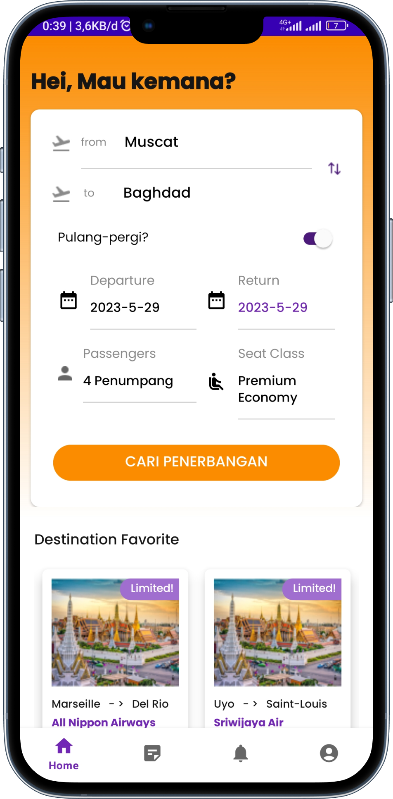

<h1 align="center"><strong> FlyWise </strong></h1> 

<h3 align="center"><strong> Mobile Application yang menangani Pemesanan Tiket Pesawat yang dibuat oleh Tim C4 AND </strong></h3>

<h2 align="center">Berikut Merupakan Mockup Aplikasi yang telah dibuat</h2>

   
   

# Android C4 Nama Anggota Kelompok
1. Ilham Okta Apriansyah
2. Husni Nabil Fareno
3. Pricilia Yusoko Putri
  
# Fitur Aplikasi yang telah Tersedia 
1. Authentikasi
    - User Login
    - User Register
    - Otp (One Time Password)
    - Forgot Password
    - Update Profile
    - User Logout   
2. Pemesanan
    - Pencarian Kota untuk Pemesanan Tiket (From & To)
    - History Pencarian Kota
    - Round-Trip (Perjalanan Pulang – Pergi)
    - One-Trip (Perjalanan 1 arah)
    - Pemilihan Tiket Penerbangan
    - Waktu Pemberangkatan & Waktu Kedatangan
    - Detail Pemesanan Tiket Penerbangan
    - Pengisian biodata Pemesan dan Penumpang
    - Checkout
   
3. Riwayat
    - Menampilkan History Pemesanan Tiket
    - Menampilkan Detail History Pemesanan Tiket
     
4. Notifikasi
     - Melihat Notifikasi yang masuk

5. Akun
     - Update Profile

6. Fitur Tambahan
    - Navigation Component
    - Homepage & Search Ticket Loginless

# Tech Stack
1. Kotlin
2. Android SDK
3. Android Studio IDE
4. Android Jetpack
5. Restful API Include Retrofit2, OkHttp, Gson, Hilt Dagger
6. Kotlin Coroutines
7. Firebase

